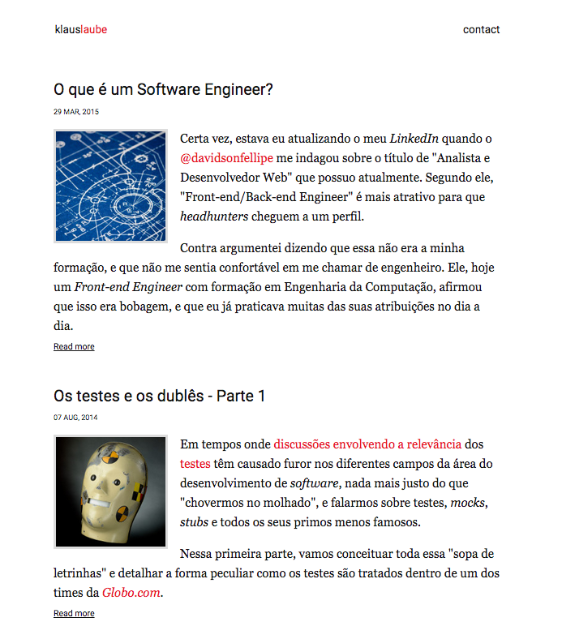

# yapeme

Yapeme (Yet Another PElican theME) is a responsive theme for Pelican.

Contributions are welcome!

## Installing

Before installing the theme, make sure you have [Yarn](https://yarnpkg.com/en/) and [Pipenv](https://github.com/pypa/pipenv) installed:

    $ brew install node pipenv

Now you can install all project's dependencies via `install` task:

    $ make install

The `build` task will make some public assets available for Pelican:

    $ make build

## Configuration

You need to edit your settings and add the following parameters:

```
AUTHOR = "Author's name"
DEFAULT_OG_IMAGE = "The og:image url"
DISQUS_SITENAME = "Your Disqus sitename"
FAVICON_URL = "The favicon url"
FACEBOOK_APP_ID = "Add your Facebook APP ID to check out insigths"
FEED_ALL_RSS = "Relative URL to output the all-posts RSS feed"
FEED_DOMAIN = "The domain prepended to feed URLs"
GOOGLE_ANALYTICS = "Your GA ID"
GOOGLE_SITE_VERIFICATION = "The Site Verification ID"
LICENSE = "The license"
LICENSE_TITLE = "A brief summary to print in a's title attribute"
LICENSE_URL = "The license url"
MENUITEMS = "A list of title,urls to be shown in your menu"
SITEDESCRIPTION = "A brief content for meta description"
SITENAME = "Your site name"
SITESUBTITLE = "A brief subtitle for your site"
SITEURL = "Base URL of your website"
SOURCE_CODE_REPOSITORY = "GitHub"
SOURCE_CODE_URL = "Where the source code of your blog is"
```

## Plugins

This theme uses the following Pelican plugins:

- [assets](https://github.com/getpelican/pelican-plugins/tree/master/assets)
- [extended_meta](https://github.com/kplaube/extended_meta)
- [i18n_subsites](https://github.com/getpelican/pelican-plugins/tree/master/i18n_subsites)
- [liquid_tags](https://github.com/getpelican/pelican-plugins/tree/master/liquid_tags)

And a Javascript widget for share buttons:

- [globocom/Share Bar](https://github.com/globocom/share-bar)

## Translations

You can find our translations inside `translations/` folder. If you want to contribute, please follow the instructions below:

    $ pybabel extract --mapping babel.cfg --output translations/messages.pot ./

This is going to create the "translations template" for the project. After that, if you want to create a new language translation:

    $ pybabel init --input-file translations/messages.pot --output-dir translations/ --locale pt_BR --domain messages

Or if you want to update a already created language file:

    $ pybabel update --input-file translations/messages.pot --output-dir translations --locale pt_BR --domain messages

Now you can update the `msgstr` with the proper translation:

    #: templates/includes/article.html:35
    msgid "By"
    msgstr "Por"

To conclude the translation, we need to compile the language file:

    $ pybabel compile -d translations

Don't forget to configure your [Pelican instance properly](http://docs.getpelican.com/en/stable/content.html#translations).

## Screenshot


