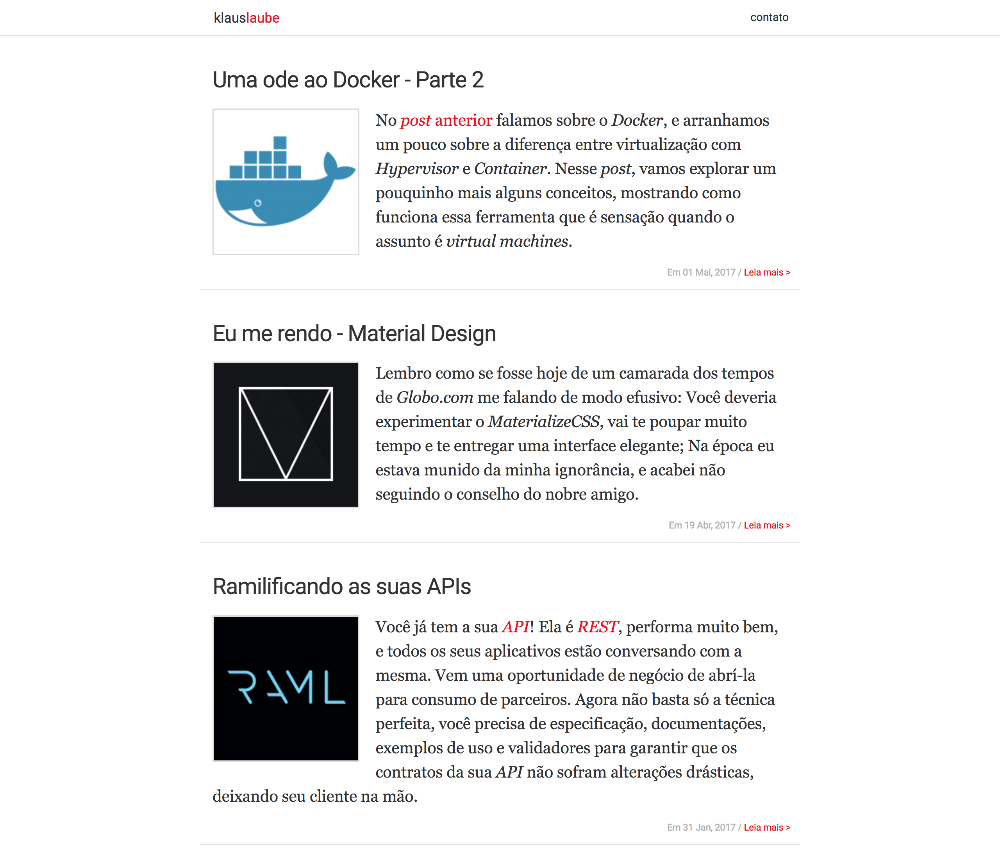

# yapeme

Yapeme (Yet Another PElican theME) is a responsive theme for Pelican.

## Installing

Before installing the theme, make sure to have [Yarn](https://yarnpkg.com/en/) (or [NPM](https://www.npmjs.com)) installed.

First, solve the Javascript dependencies by running the following:


```text
yarn global add postcss-cli
yarn install
```

And finally, the Python dependencies:

```text
pip install -r requirements.txt
```

If you are running your blog/website in a Python `virtualenv`, make sure to install the template's dependencies there.

## Plugins

This theme uses the following Pelican plugins:

- Installed with `requirements.txt` (no action needed):
  - [webassets](https://github.com/pelican-plugins/webassets) `(required)`
- Installed [through forking](https://github.com/getpelican/pelican-plugins/tree/master#how-to-use-plugins) `pelican-plugins` repository:
  - [i18n_subsites](https://github.com/getpelican/pelican-plugins/tree/master/i18n_subsites) `(required)`
  - [summary](https://github.com/getpelican/pelican-plugins/tree/master/summary) `(recommended)`
  - [representative_image](https://github.com/getpelican/pelican-plugins/tree/master/representative_image) `(recommended)`

- Installed through manual intervention:
  - [extended_meta](https://github.com/kplaube/extended_meta) `(optional)`

## Configuration

A mandatory thing is to have `jinja2.ext.i18n` listed as a Jinja extension:

```python
JINJA_ENVIRONMENT = {"extensions": ["jinja2.ext.i18n"]}
```

Also, set `I18N_TEMPLATES_LANG` to `pt_BR` if you want the theme
in Brazilian Portuguese 🇧🇷

Bellow you can see the list of all parameters used by the theme:

```text
AUTHOR = "Author's name"
DISQUS_SITENAME = "Your Disqus sitename"
FACEBOOK_APP_ID = "Add your Facebook APP ID to check out insigths"
FEED_ALL_RSS = "Relative URL to output the all-posts RSS feed"
FEED_DOMAIN = "The domain prepended to feed URLs"
GOOGLE_ANALYTICS = "Your GA ID"
GOOGLE_SITE_VERIFICATION = "The Site Verification ID"
LICENSE = "The license"
LICENSE_TITLE = "A brief summary to print in a's title attribute"
LICENSE_URL = "The license url"
MENUITEMS = "A list of title,urls to be shown in your menu"
SITEDESCRIPTION = "A brief content for meta description"
SITENAME = "Your site name"
SITESUBTITLE = "A brief subtitle for your site"
SITEURL = "Base URL of your website"
SOURCE_CODE_REPOSITORY = "GitHub"
SOURCE_CODE_URL = "Where the source code of your blog is"
```

## Translations

You can find the translations inside `translations/` folder. If you want to contribute, please follow the instructions below:

```text
pybabel extract --mapping babel.cfg --output translations/messages.pot ./
```

This is going to create the "translations template" for the project. After that, if you want to create a new language translation:

```text
pybabel init --input-file translations/messages.pot --output-dir translations/ --locale pt-br --domain messages
```

Or if you want to update a already created language file:

```text
pybabel update --input-file translations/messages.pot --output-dir translations --locale pt-br --domain messages
```

Now you can update the `msgstr` with the proper translation:

```text
#: templates/includes/article.html:35
msgid "By"
msgstr "Por"
```

To conclude the translation, we need to compile the language file:

```text
pybabel compile -d translations
```

Don't forget to configure your [Pelican instance properly](http://docs.getpelican.com/en/stable/content.html#translations).

## Screenshot


